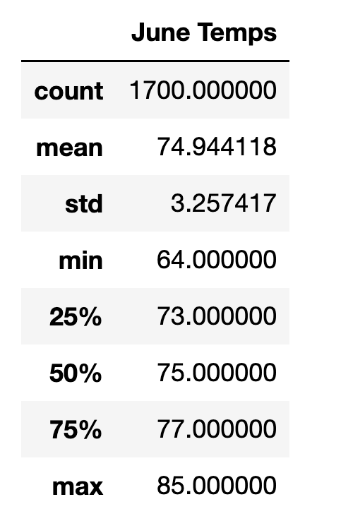
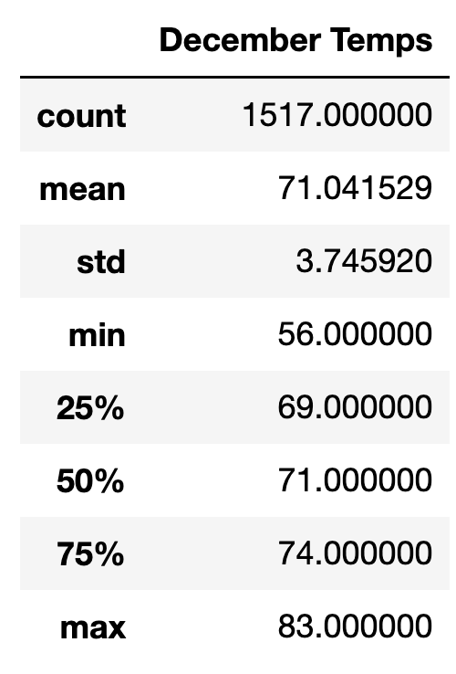

# Surf's Up

Module 9: Advanced Data Storage and Retrieval

## Overview of the analysis

Some businesses are highly influenced by weather conditions, for example, ski resorts. 

Here a prospective business owner on Hawai'i is concerned about the weather. 

The purpose of this study is to provide an analysis of temperature differences between the months of June and December. 

## Results

Daily meteorological data from a variety of observatories on Hawai'i from 2010 to 2016 was provided in a sqlite file. Summary statistics were calculated for temperatures in June and December.

- More observations were made in June (1700) than December (1517), even though December has more days than June.

- The mean temperature in June (74.9) was 3.9 degrees greater than the mean temperature in December (71.0).

- Temperature fluctuations are greater in December than June, because the standard deviation of temperatures in December is 3.75, which is greater than the standard deviation of temperatures in June is 3.26.

| June | December |
| :-: | :-: |
|  |  |

## Summary: 

On Hawai'i between the years 2010 and 2016, it is warmer in June than December. This is reflected in differences in mean and quartile statistics.

Also, temperatures fluctuate more in December than June.

Further queries could include:

- Repeat this analysis for additional months for a finer-grained perspective on temperature differences throughout the year.

- Repeat this analysis, but use precipitation instead of temperature.
